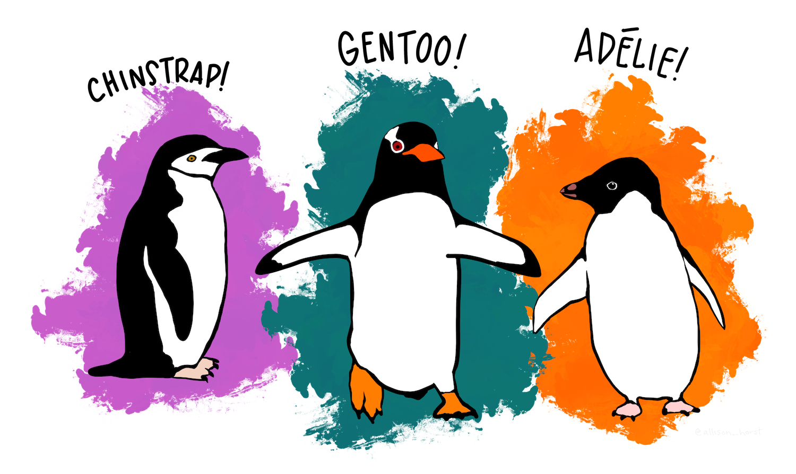

```{r setup, include=FALSE}

# install.packages("shiny")
# install.packages("learnr")
# install.packages("tidyverse")
# install.packages("palmerpenguins")
# install.packages("kableExtra")
# install.packages("fontawesome")
# install.packages("here")

library(shiny)
library(learnr)
library(tidyverse)
library(palmerpenguins)
library(kableExtra)
library(fontawesome)
library(here)


knitr::opts_chunk$set(echo = FALSE)
```

## 1. Benvinguda

En aquest tutorial, aprendràs algunes funcions bàsiques que t'ajudaran a treballar amb dades, utilitzant el paquet `dplyr`, que forma part del `tidyverse` a *R*.


#### Què és tidyverse?

El [tidyverse](https://www.tidyverse.org/) és una col·lecció de paquets que contenen funcions útils per treballar amb dades i visualitzar-les (i moltes altres coses). No cal que instal·lis el `tidyverse` per escriure o executar el codi d'aquest tutorial, ja que ja està carregat en aquest entorn, però pots instal·lar-lo amb `install.packages("tidyverse")` per treballar amb ell pel teu compte fora d'aquest tutorial.

#### Què és dplyr?

```{r, echo=FALSE, out.width="30%", fig.align = "left"}

knitr::include_graphics("images/dplyr_hex.png") 

```

`dplyr` és un dels paquets del `tidyverse`. Allotja moltes funcions que ens faciliten treballar amb dades. Inclouen coses com seleccionar columnes específiques, decidir quines files mantenir basant-nos en si compleixen o no les nostres condicions, i trobar estadístiques resum per a diferents variables i grups. A vegades anomenem aquests passos part de "data wrangling" (manipulació de dades).

```{r, echo=FALSE, out.width="100%", fig.align = "center", fig.cap = "Illustration from Hadley Wickham's 2019 talk, The Joy of Functional Programming"}

knitr::include_graphics("images/data_wrangler.png") 

```

#### Què hi ha en aquest tutorial?

En aquest tutorial, aprendràs i practicaràs exemples utilitzant les funcions centrals de `dplyr` per treballar amb dades. Aquestes són:

- `filter()`: preserva les files que compleixen una condició
- `select()`: preserva les columnes compleixen una condició
- `rename()`: reanomena columnes (variables)
- `relocate()`: reordena les columnes
- `mutate()`: crea noves columnes
- `group_by()` + `summarize()`: obtens estadístiques resum per a diferents grups
- `across()`: aplicar funcions a múltiples columnes
- `count()`: comptar els elements d'una variable
- `case_when()`: aplica transformacions condicionals (per les ments més inquietes!)


#### Blocs de codi per les activitats

A cada secció del tutorial, trobaràs exemples i activitats pràctiques. Completaràs activitats pràctiques en blocs de codi, com el que es mostra a continuació. Un cop introdueixis el teu codi, prem 'Run' per veure el resultat. Si et quedes encallat, demana'm ajuda o bé prem el botó 'Hint' o 'Solution'.

```{r calculator, exercise = TRUE}
0.2 + 0.3
```

```{r calculator-hint}
0.2 + 0.4 # Hauria de sumar 0.4
```

```{r calculator-solution}
(0.2 + 0.4)*100 # Multiplica per 100 per obtenir un percentatge
```

Quan pulses 'Run', el **resultat** del codi es mostra a sota del bloc de codi.

Prova-ho tu escrivint a continuació algun càlcul bàsic, i observa que quan actualitzes els números i prem 'Run', la sortida s'actualitza.

```{r practice_calc, exercise = TRUE}

```

```{r, echo=FALSE, out.width="80%", fig.align = "center"}
knitr::include_graphics("images/r_learners_sm.jpeg")  
```


<body>


## 2. Dades

Practicarem amb les dades dels pingüins inefos. Aquestes dades són un subconjunt de les dades originals de Gorman et al. (2014) i estan disponibles a través del paquet `palmerpenguins` de R.

No necessites importar l'arxiu per treballar en aquest tutorial, ja que les dades ja estan aquí esperant darrere de les escenes. Si mai vols utilitzar el conjunt de dades `penguins` fora d'aquest tutorial, pots instal·lar el paquet `palmerpenguins` de CRAN utilitzant `install.packages("palmerpenguins")` i aprendre'n més sobre el paquet [aquí](https://allisonhorst.github.io/palmerpenguins/).


#### T'explico una mica sobre els pingüins?

Hi ha 3 especies de pingüins en aquest conjunt de dades: Adelie, chinstrap i gentoo. 

```{r, echo=FALSE, out.width="100%", fig.align = "center"}

```

El data.frame conté 8 variables

- **species:** un factor que denota la espècie (Adelie, Chinstrap, or Gentoo)
- **island:** un factor que denota l'illa on l'han observat (Palmer Archipelago, Antarctica)
- **bill_length_mm:** un número que denota la longitud de la cresta dorsal del bec del pingüí (mil·límetres)
- **bill_depth_mm:** un número que denota la profunditat del bec del pingüí (mil·límetres)
- **flipper_length_mm:** un número que denota la longitud de la aleta del pingüí (mil·límetres)
- **body_mass_g:** un número que denota la massa corporal del pingüí (grams)
- **sex:** un factor que denota el sexe del pingüí (male, female)
- **year:** l'any d'observació (2007, 2008, or 2009)

#### Fem una ullada a les dades?

A continuació farem un cop d'ull a les primeres 10 línies de les dades dels pingüins (`NA`s indica valors perduts en tot el conjunt de dades). Observa que les dades ja estan en format *tidy* - el que significa que:

- Cada variable és una columna
- Cada observació és una fila
- Cada valor està en la seva pròpia cel·la


```{r inspect, exercise = TRUE}
head(penguins, 10)
```

Això és molt llarg! sabries obtenir 5 files en lloc de 10?

```{r inspection, exercise = TRUE}

```

```{r inspection-hint}
head(penguins, 15)
```

Perfecte, endavant amb `filter()`!


## 3. filter()

[CLICA AQUÍ](https://dplyr.tidyverse.org/reference/filter.html) per veure la documentació de `filter()`

Utilitza `filter()` per crear un subconjunt de les dades només amb les files que compleixen les teves condicions.


A la imatge següent, les dades han de satisfer dues condicions perquè una fila (observació) es mantingui: *type* ha de coincidir amb "otter", i *site* ha de coincidir amb "bay". Només dues de les files compleixen aquestes condicions (les que estan ressaltades en lila), així que només aquestes dues es mantindrien en executar el codi.

```{r, echo=FALSE, out.width="80%", fig.align = "center"}
knitr::include_graphics("images/dplyr_filter_sm.png")
```

Anem a aprendre algunes formes diferents de com podem utilitzar `filter()` per ajudar-nos a mantenir o excloure files basades en les nostres condicions.

### EXEMPLES DE FILTRES

#### `r fa("fas fa-robot", fill = "purple")` Exemple 1

Fer un subconjunt amb només els pingüins "Chinstrap".

El codi següent **filtra** les dades dels **pingüins** per mantenir només les files on **species** coincideix exactament amb "Chinstrap" (ojo, sensible a majúscules i minúscules). Tingues en compte que quan la nostra condició es basa en una cadena, la cadena està entre cometes (aquí, "Chinstrap").

```{r, echo = TRUE, message = FALSE, warning = FALSE}
filter(penguins, species == "Chinstrap")
```

#### `r fa("fas fa-robot", fill = "purple")` Exemple 2

Amb `penguins`, filtrar per incloure només els pingüins "Chinstrap" i "Gentoo".

Primer, hem de tenir cura del tipus d'afirmació que escriurem. Si volem crear un subconjunt que contingui chinstraps **i** gentoos, això vol dir que volem mantenir les files on l'espècie coincideix amb "Chinstrap" **O** "Gentoo", veritat?. Podem fer-ho de diverses maneres:

- Utilitzant l'operador **O**, `|` (la línia vertical), entre condicions
- Utilitzant l'operador `%in%`, seguit d'un vector de valors per buscar una coincidència


```{r, echo = TRUE, message = FALSE, warning = FALSE, eval = FALSE}
# Primer: utilitzant |
filter(penguins, species == "Chinstrap" | species == "Gentoo")
```

Obtens el mateix que amb...

```{r, echo = TRUE, message = FALSE, warning = FALSE}
# Segon: utilitzant %in% 
filter(penguins, species %in% c("Chinstrap", "Gentoo"))
```

Fixa't que el resultat és idèntic per ambdós mètodes anteriors. Pot semblar que la primera manera és més fàcil ara mateix - però si tens moltes coincidències potencials que estàs buscant, la segona manera redueix la redundància i augmenta la llegibilitat del codi.

**ATENCIÓ**: La condició `letter == c("A", "B")` és **molt diferent** de `letter %in% c("A", "B")` - probablement mai voldràs fer la primera, perquè recorrerà les files de la columna `letter` buscant les cadenes "A" i "B" **en aquest ordre**. En altres paraules, buscarà "A" a la fila 1, després "B" a la fila 2, després "A" a la fila 3, després "B" a la fila 4, etc. - quan el que probablement vols fer és preguntar "Mira a cada fila i manté-la si és "A" o "B"", que és el que farà la segona opció (`letter %in% c("A", "B")`).

#### `r fa("fas fa-robot", fill = "purple")` Exemple 3

Et presento l'operador de canal (li diuen *pipe*) (`|>`)!

En els seguents exemples, especificarem el conjunt de dades dins de la funció `filter()`. Això està bé per ara, però en endavant voldrem utilitzar l'operador de canal (`|>`) per realitzar operacions en una seqüència lògica. Pots pensar en l'operador de canal com si diguéssim "i després" al teu codi. Per exemple:

Recull llenya I DESPRÉS obre la xemeneia I DESPRÉS encén el foc:

```
Recull llenya |>
  obre la xemeneia |>
  encén el foc
```
Diguem que vols utilitzar l'operador de canal en l'Exemple anterior per filtrar els chinstraps. Comencem dient a R el nom del marc de dades, I DESPRÉS què fer amb ell: dades `|>` cosa, com això:

```{r, echo = TRUE, message = FALSE, warning = FALSE}
penguins |>
  filter(species == "Chinstrap")
```

A partir d'ara, utilitzarem l'operador de canal.

#### `r fa("fas fa-robot", fill = "purple")` Exemple 4

Amb `penguins`, fem un subconjunt amb els pingüins Adelie a Dream Island.

Pensa un moment les condicions. En aquest cas, només volem mantenir les observacions (files) on l'espècie és "Adelie" **I** l'illa és "Dream" - una fila només s'ha de mantenir si es compleixen totes dues condicions. Hi ha diverses maneres de redactar una afirmació **i** dins de `filter()`, incloent:

- Una coma entre condicions indica que s'han de complir totes dues (`filter(x == "a", y == "b")`)
- Amb un ampersand entre condicions indica que s'han de complir totes dues (`filter(x == "a" & y == "b")`)

Crearem aquest subconjunt de la següent manera:

```{r, echo = TRUE, message = FALSE, warning = FALSE}
penguins |>
  filter(species == "Adelie", island == "Dream")
```

### Preservar o excloure files basades en valors

També podem utilitzar `filter()` per mantenir o excloure files basades en valors de variables utilitzant operadors lògics estàndard (`==`, `<=`, `>=`, `<`, `>`).

Al contrari que quan establim condicions per a cadenes, els valors dins de `filter()` no han d'estar dins de cometes.

#### `r fa("fas fa-robot", fill = "purple")` Exemple 5

Amb `penguins`, mantenim els pingüins amb una longitud de bec superior a 200 mm.

```{r, echo = TRUE, message = FALSE, warning = FALSE}
penguins |>
  filter(flipper_length_mm > 200)
```

#### `r fa("fas fa-robot", fill = "purple")` Exemple 6

Amb `penguins`, mantenim les observacions on la massa corporal és inferior o igual a 2900 g.

```{r, echo = TRUE, message = FALSE, warning = FALSE}
penguins |>
  filter(body_mass_g <= 2900)
```

#### `r fa("fas fa-robot", fill = "purple")` Exemple 7

Amb `penguins`, mantenim les observacions dels pingüins Adelie amb una longitud de bec superior a 40 mm.

```{r, echo = TRUE, message = FALSE, warning = FALSE}
penguins  |> 
  filter(species == "Adelie", bill_length_mm > 40)
```

### Excloure files basades en condicions

Imagina que tens un conjunt de dades que conté 10 espècies de pingüins (i no 3 com el nostre), i vols mantenir les observacions de 8 d'aquestes espècies. Això seria una llista llarga d'espècies per igualar - si et refereixes a les que vols mantenir.

També pots utilitzar `filter()` per excloure observacions basades en valors de variables. Utilitza `!=` per indicar "no coincideix" dins de la funció `filter()`.

#### `r fa("fas fa-robot", fill = "purple")` Exemple 8

Exclou les observacions dels chinstraps de les dades `penguins`. En el codi següent, l'operador `!=` s'utilitza dins de `filter()` per mantenir les observacions on la variable d'espècie **no coincideix** amb "Chinstrap".

```{r, echo = TRUE, message = FALSE, warning = FALSE}
penguins |>
  filter(species != "Chinstrap")
```

<br>
<br>
<hr class="Examples">

### ET TOCA A TU!!

Als blocs de codi següents, escriu el teu propi codi per practicar amb la funció `filter()`. Si et quedes aturat, fes clic als botons "Pista" i "Solució".

#### `r fa("fas fa-keyboard", fill = "purple")` Activitat Pràctica 1

Utilitza `filter()` per crear un subconjunt de `penguins` que només contingui pingüins gentoo amb una profunditat de bec superior o igual a 15.5 mil·límetres.

```{r test_q1, exercise = TRUE}

```

```{r test_q1-hint, warning = FALSE}
penguins |>
  filter(species == "", bill_depth_mm > ___)
```

```{r filter_q1-solution}
penguins |>
  filter(species == "Gentoo", bill_depth_mm > 15.5)
```

#### `r fa("fas fa-keyboard", fill = "purple")` Activitat Pràctica 2

Utilitza `filter()` per crear un subconjunt de `penguins` que només contingui pingüins mascles enregistrats a les illes Dream i Biscoe.

```{r filter_q2, exercise = TRUE}

```

```{r filter_q2-hint}
penguins |>
  filter(island %in% c("_____","_____"),
         sex == "_____")
```

```{r filter_q2-solution}
penguins |>
  filter(island %in% c("Dream","Biscoe"),
         sex == "male")
```

#### `r fa("fas fa-keyboard", fill = "purple")` Activitat Pràctica 3

Utilitza `filter()` per crear un subconjunt de `penguins` que només contingui pingüins femelles Adelie amb longitud de bec inferior a 35 mm.

```{r filter_q3, exercise = TRUE}

```

```{r filter_q3-hint}
penguins |>
  filter(sex == "_____",
         species == "_____",
         bill_length_mm < _____)
```


```{r filter_q3-solution}
penguins |>
  filter(sex == "female",
         species == "Adelie",
         bill_length_mm < 35)
```

#### `r fa("fas fa-keyboard", fill = "purple")` Activitat Pràctica 4

Crea un subconjunt de `penguins` que contingui observacions de pingüins chinstrap femelles a les illes Dream i Torgersen.

```{r filter_q4, exercise = TRUE}

```

```{r filter_q4-hint}
penguins |>
  filter(sex == "____",
         species == "____") |>
  filter(island %in% c("____","____"))
```

```{r filter_q4-solution}
penguins |>
  filter(sex == "female",
         species == "chinstrap") |>
  filter(island %in% c("Dream","Torgersen"))
```

#### `r fa("fas fa-keyboard", fill = "purple")` Activitat Pràctica 5

Crea un subconjunt de `penguins` que contingui pingüins que siguin gentoo **O** tinguin una massa corporal superior a 4500 g.

```{r filter_q5, exercise = TRUE}

```

```{r filter_q5-hint}
penguins |>
  filter(species == "_____" | body_mass_g > _____)
```

```{r filter_q5-solution}
penguins |>
  filter(species == "Gentoo" | body_mass_g > 4500)
```


## 4. select()

[CLICA AQUÍ](https://dplyr.tidyverse.org/reference/select.html) per veure la documentació de `select()`.

La funció principal de `select()` és ajudar-te a triar quines **columnes** (si les teves dades estan en format tidy, les columnes són variables) vols mantenir o excloure.

Mentre que fer subconjunts de variables rarament és *necessari* per a anàlisis (i sovint no es recomana), pot fer que conjunts de dades grans amb moltes variables siguin més manejables.

### EXEMPLES DE SELECCIÓ

Dins `select()`, llista les variables que vols mantenir en el teu nou subconjunt, separades per comes. Selecciona un rang de variables seqüencials utilitzant dos punts `:` entre les variables dels extrems inclusius. Per exemple, per seleccionar de les columnes `giraffe` a `narwhal` tot el rang es fa referència amb `giraffe:narwhal`. Nota: també pots utilitzar `select()` per reordenar columnes - l'ordre en què es llisten dins de `select()` és l'ordre en què apareixeran en el nou subconjunt.

#### `r fa("fas fa-robot", fill = "purple")` Exemple 1

Queda't les columnes `year`, `island` i `species` de les dades `penguins`.

```{r, echo = TRUE, warning = FALSE, message = FALSE}
penguins |>
  select(year, island, species)
```

#### `r fa("fas fa-robot", fill = "purple")` Exemple 2

Queda't amb les columnes `species` i `body_mass_g` de les dades `penguins`.

```{r, echo = TRUE, warning = FALSE, message = FALSE}
penguins |>
  select(species, body_mass_g)
```

#### `r fa("fas fa-robot", fill = "purple")` Exemple 3

Amb les dades `penguins`, queda't amb totes les columnes entre `species` i `body_mass_g`.

```{r, echo = TRUE, warning = FALSE, message = FALSE}
penguins |>
  select(species:body_mass_g)
```

#### `r fa("fas fa-robot", fill = "purple")` Exemple 4

Queda't amb les columnes de `species` a `bill_depth_mm` *i* `year` de les dades dels pingüins. Tingues en compte que les variables addicionals (no seqüencials) s'afegeixen després d'una coma, així:

```{r, echo = TRUE, warning = FALSE, message = FALSE}
penguins |>
  select(species:bill_depth_mm, year)
```

### Excloure columnes

Utilitza el signe menys (`-`) davant del nom d'una variable per excloure-la. Per exemple, si afegim `-giraffe` dins la funció `select()`, la columna `giraffe` serà exclòs.

Per excloure un rang de columnes, utilitza `!(giraffe:narwhale)`.

Per excloure diverses columnes no seqüencials, utilitza `!c(giraffe, llop, tauró)`.

#### `r fa("fas fa-robot", fill = "purple")` Exemple 5

Amb les dades `penguins`, queda't amb totes les columnes excepte `island`.

```{r, echo = TRUE, warning = FALSE, message = FALSE}
penguins |>
  select(-island)
```

#### `r fa("fas fa-robot", fill = "purple")` Exemple 6

Amb les dades `penguins`, queda't amb totes les columnes excepte `island` a `bill_depth_mm`.

```{r, echo = TRUE, warning = FALSE, message = FALSE}
penguins |>
  select(!(island:bill_depth_mm))
```

#### `r fa("fas fa-robot", fill = "purple")` Exemple 7

Amb les dades `penguins`, queda't amb totes les columnes excepte `species`, `flipper_length_mm` i `year`.

```{r, echo = TRUE, warning = FALSE, message = FALSE}
penguins |>
  select(!c(species, flipper_length_mm, year))
```

### Algunes funcions útils

Hi ha **moltes** funcions auxiliars que afegiran superpoders a `select()` (per exemple, seleccionar totes les variables d'una classe específica, o seleccionar totes les variables que comencen o acaben amb un cert patró de cadena). Consulta més [aquí](https://dplyr.tidyverse.org/reference/select.html).

N'explorarem algunes: `starts_with()`, `ends_with()` i `contains()`. Aquestes et permeten seleccionar qualsevol columna que compleixi les teves condicions pel nom de la columna.

#### `r fa("fas fa-robot", fill = "purple")` Exemple 8

Queda't amb les columnes que comencen amb "bill".

```{r, echo = TRUE, warning = FALSE, message = FALSE}
penguins |>
  select(starts_with("bill"))
```

#### `r fa("fas fa-robot", fill = "purple")`Exemple 9

Queda't amb les columnes que acaben amb "mm".

```{r, echo = TRUE, warning = FALSE, message = FALSE}
penguins |>
  select(ends_with("mm"))
```

#### `r fa("fas fa-robot", fill = "purple")` Exemple 10

Queda't amb les columnes que contenen "length".

```{r, echo = TRUE, warning = FALSE, message = FALSE}
penguins |>
  select(contains("length"))
```

#### `r fa("fas fa-robot", fill = "purple")` Exemple 11

Queda't amb les columnes que contenen "length" O comencen amb "bill".

```{r, echo = TRUE, warning = FALSE, message = FALSE}
penguins |>
  select(contains("length") | starts_with("bill"))
```

### Exemples en seqüència

#### `r fa("fas fa-robot", fill = "purple")` Exemple 12

Fes un subconjunt de pingüins que només conté observacions per a pingüins Gentoo, i després només manté les columnes per `island`, `sex` i `body_mass_g.`

```{r, echo = TRUE, warning = FALSE, message = FALSE}
penguins |>
  filter(species == "Gentoo") |>
  select(island, sex, body_mass_g)
```

#### `r fa("fas fa-robot", fill = "purple")` Exemple 13

Fes un subconjunt de pingüins que només conté observacions per a pingüins `male` amb `flipper_length_mm` més llargues de 200 mm, i després només manté les columnes que acaben amb "mm".

```{r, echo = TRUE, warning = FALSE, message = FALSE}
penguins |>
  filter(sex == "male", flipper_length_mm > 200) |>
  select(ends_with("mm"))
```

<br>
<br>
<hr class="Examples">

### ARA TU!

A la part de sota, escriu el teu propi codi per practicar amb la funció `select()`. Si et quedes encallat, clica els botons "Hint" o "Solution".

#### `r fa("fas fa-keyboard", fill = "purple")` Activitat Pràctica 1

A partir de les dades `penguins`, queda't només amb la variable `body_mass_g`.

```{r select_q1, exercise = TRUE}

```

```{r select_q1-solution}
penguins |>
  select(body_mass_g)
```

#### `r fa("fas fa-keyboard", fill = "purple")` Activitat Pràctica 2

A partir de les dades `penguins`, queda't amb les columnes de `bill_length_mm` a `body_mass_g`, i `year`.

```{r select_q2, exercise = TRUE}

```

```{r select_q2-hint}
penguins |>
  select(______:______, ______)
```

```{r select_q2-solution}
penguins |>
  select(bill_lenth_mm:body_mass_g, year)
```

#### `r fa("fas fa-keyboard", fill = "purple")` Activitat Pràctica 3

A partir de les dades `penguins`, queda't amb totes les columnes excepte `island`.

```{r select_q3, exercise = TRUE}

```

```{r select_q3-solution}
penguins |>
  select(-island)
```

#### `r fa("fas fa-keyboard", fill = "purple")` Activitat Pràctica 4

A partir de les dades `penguins`, queda't amb totes les columnes excepte `species`, `sex` i `year`.

```{r select_q4, exercise = TRUE}

```

```{r select_q4-hint}
penguins |>
  select(!c(____, ____, ____))
```

```{r select_q4-solution}
penguins |>
  select(!c(species, sex, year))
```

#### `r fa("fas fa-keyboard", fill = "purple")` Activitat Pràctica 5

A partir de les dades `penguins`, queda't amb la columna `species` i qualsevol columna que acabi amb "mm".

```{r select_q5, exercise = TRUE}

```

```{r select_q5-hint}
penguins |>
  select(______, ends_with("__"))
```

```{r select_q5-solution}
penguins |>
  select(species, ends_with("mm"))
```

#### `r fa("fas fa-keyboard", fill = "purple")` Activitat Pràctica 6

A partir de les dades `penguins`, queda't amb les columnes que contenen "bill" O acaben amb "mm".

```{r select_q6, exercise = TRUE}

```

```{r select_q6-hint}
penguins |>
  select(contains("___") | ends_with("___"))
```

```{r select_q6-solution}
penguins |>
  select(contains("bill") | ends_with("mm"))
```

#### `r fa("fas fa-keyboard", fill = "purple")` Activitat Pràctica 7

En una seqüència de canals (pipes), començant per `penguins`:

- Només conserva observacions per a pingüins female observats a Dream Island, I DESPRÉS...
- Només conserva les columnes `species`, i qualsevol columna que comenci per "bill".

```{r select_q7, exercise = TRUE}

```

```{r select_q7-hint}
penguins |>
  filter(sex == "_____", island == "_____") |>
  select(_____, starts_with("____"))
```

```{r select_q7-solution}
penguins |>
  filter(sex == "female", island == "Dream") |>
  select(species, starts_with("bill"))
```


## 5. relocate()

[CLICA AQUÍ](https://dplyr.tidyverse.org/reference/relocate.html) per consultar la documentació de  `relocate()`

```{r, echo=FALSE, out.width="100%", fig.align = "center"}
knitr::include_graphics("images/dplyr_relocate.png")
```

Utilitza `relocate()` per moure columnes, sense tocar les files o els grups. Alguns punts útils:

- Utilitza `.before` o `.after` per moure una columna abans o després d'una altra (per nom o classe)
- Si una sola columna està dins de la funció (p. ex. `relocate(col_A)`), aquesta columna es mou a l'inici

Trobaràs més detalls i més exemples a tidyverse.org [aquí](https://dplyr.tidyverse.org/reference/relocate.html).


### EXEMPLES AMB RELOCATE

#### `r fa("fas fa-robot", fill = "purple")` Exemple 1

Mou la columna `year` al principi de les dades `penguins`.

```{r, echo = TRUE, warning = FALSE, message = FALSE}
penguins |>
  relocate(year)
```

#### `r fa("fas fa-robot", fill = "purple")` Exemple 2

Comença amb `penguins`, mou la columna `flipper_length_mm` després de la columna `island`.

```{r, echo = TRUE, warning = FALSE, message = FALSE}
penguins |>
  relocate(flipper_length_mm, .after = island)
```

#### `r fa("fas fa-robot", fill = "purple")` Exemple 3

Começa amb `penguins`, mou la columna `bill_length_mm` abans de la columna `year`.

```{r, echo = TRUE, warning = FALSE, message = FALSE}
penguins |>
  relocate(bill_length_mm, .before = year)
```

#### `r fa("fas fa-robot", fill = "purple")` Exemple 4

Começa amb `penguins`, mou qualsevol variable numèrica després de qualsevol variable de factor.

```{r, echo = TRUE, warning = FALSE, message = FALSE}
penguins |>
  relocate(where(is.numeric), .after = where(is.factor))
```

<br>
<br>
<hr class="Examples">

### ARA TU!

En els fragments de codi següents, escriu el teu propi codi per practicar amb la funció `relocate()`. Si et quedes aturat, clica en els botons "Pista" o "Solució".

#### `r fa("fas fa-keyboard", fill = "purple")` Activitat Pràctica 1

Comença amb `penguins`, mou la columna `species` abans de la columna `sex`.

```{r relocate_q1, exercise = TRUE}

```
```{r relocate_q1-solution}
penguins |>
  relocate(species, .before = sex)
```

#### `r fa("fas fa-keyboard", fill = "purple")` Activitat Pràctica 2

Começa amb `penguins`, mou la columna `bill_length_mm` perquè sigui la primera columna.

```{r relocate_q2, exercise = TRUE}

```

```{r relocate_q-solution}
penguins |>
  relocate(bill_length_mm)
```

#### `r fa("fas fa-keyboard", fill = "purple")` Activitat Pràctica 3

Mou les variables de factor (pista: `is.factor`) després de les variables enteres (`is.integer`).

```{r relocate_q3, exercise = TRUE}

```

```{r relocate_q3-solution}
penguins |>
  relocate(where(is.factor), .after = where(is.integer))
```


## 6. rename()

[CLICA AQUÍ](https://dplyr.tidyverse.org/reference/rename.html) per trobar la documentació de `rename()`

Utilitza `rename()` per canviar el nom d'una o més columnes. Generalment, tindrà un aspecte semblant a això:

  `df |> rename(nom_nou = nom_inicial)`

També pots utilitzar la funció per canviar el nom de diverses columnes amb `rename_with()`.

```{r, echo=FALSE, out.width="100%", fig.align = "center"}
knitr::include_graphics("images/rename_sm.jpg")
```


### EXEMPLES AMB RENAME

#### `r fa("fas fa-robot", fill = "purple")` Exemple 1

Reanomena la columna `island` i posa-li `palmer_island`.

```{r, echo = TRUE, warning = FALSE, message = FALSE}
penguins |>
  rename(palmer_island = island)
```

#### `r fa("fas fa-robot", fill = "purple")` Exemple 2

Reanomena la columna `year` per `study_yr`, i `body_mass_g` per `mass`.

```{r, echo = TRUE, warning = FALSE, message = FALSE}
penguins |>
  rename(study_yr = year, mass = body_mass_g)
```

#### `r fa("fas fa-robot", fill = "purple")` Exemple 3

Convertir tots els noms de columna de `penguins` a majúscules amb `toupper`.

Nota: Això probablement no és una cosa que vulguis fer en la vida real.

```{r, echo = TRUE, warning = FALSE, message = FALSE}
penguins |>
  rename_with(toupper)
```

#### `r fa("fas fa-robot", fill = "purple")` Exemple 4.

Convertir tots els noms de columna de `penguins` que acabin amb "mm" a majúscules (`toupper`).

```{r, echo = TRUE, warning = FALSE, message = FALSE}
penguins |>
  rename_with(toupper, ends_with("mm"))
```

<br>
<br>
<hr class="Examples">

### ARA TU!

#### `r fa("fas fa-keyboard", fill = "purple")` Activitat Pràctica 1

Començant amb `penguins`, reanomena la columna `flipper_length_mm` per `flipper_mm`.

```{r rename_q1, exercise = TRUE}

```

```{r rename_q1-solution}
penguins |>
  rename(flipper_mm = flipper_length_mm)
```

#### `r fa("fas fa-keyboard", fill = "purple")` Activitat Pràctica 2

A partir de `penguins`, reanomena la columna `island` per `island_name` i la columna `species` per `penguin_spp`.

```{r rename_q2, exercise = TRUE}

```

```{r rename_q2-solution}
penguins |>
  rename(island_name = island,
         penguin_spp = species)
```

#### `r fa("fas fa-keyboard", fill = "purple")` Activitat Pràctica 3

A partir de `penguins`, converteix els noms de columna que comencin per "bill" a majúscules.

```{r rename_q3, exercise = TRUE}

```

```{r rename_q3-hint}
penguins |>
  rename_with(____, starts_with("____"))
```

```{r rename_q3-solution}
penguins |>
  rename_with(toupper, starts_with("bill"))
```

## 7. mutate()

[CLICA AQUÍ](https://dplyr.tidyverse.org/reference/mutate.html) per trobar més informació sobre `mutate()`

Utilitza `mutate()` per afegir una nova columna, mantenint les columnes existents. L'estructura general és:

```{r, echo = TRUE, eval = FALSE}
df |>
  mutate(nom_nou_columna = el_que_contindrà)
```


Per exemple, si tingués un data frame `df` amb les columnes `A` i `B`, puc afegir una nova columna `C` que sigui la suma de `A` i `B` de la següent manera (nota: també pots utilitzar `sum(A,B)` aquí en lloc de `A + B`):

```{r, echo = TRUE, eval = FALSE}
df |>
  mutate(C = A + B)
```

...com es demostra amb els monstres mutants següents:

```{r, echo=FALSE, out.width="80%", fig.align = "center"}
knitr::include_graphics("images/dplyr_mutate.png")
```

### EXEMPLES AMB MUTATE

#### `r fa("fas fa-robot", fill = "purple")` Exemple 1

Afegeix una nova columna a `penguins` amb body_mass_g (actualment en grams) convertida a quilograms.

```{r, echo = TRUE, warning = FALSE, message = FALSE}
penguins |>
  mutate(body_mass_kg = body_mass_g / 1000)
```

#### `r fa("fas fa-robot", fill = "purple")` Exemple 2

Afegeix una nova columna a `penguins` amb la relació de la longitud del bec a la profunditat del bec.

```{r, echo = TRUE, warning = FALSE, message = FALSE}
penguins |>
  mutate(bill_ratio = bill_length_mm / bill_depth_mm)
```


#### `r fa("fas fa-robot", fill = "purple")` Exemple 3

També pots afegir múltiples columnes noves dins d'un sol `mutate()`.

Per exemple, afegim tres noves columnes a `penguins` dins d'una sola funció `mutate()`: una columna que conté la relació del bec (longitud del bec / profunditat del bec), una que conté la massa corporal convertida a kg, i una que conté la longitud de la aleta convertida a metres.

```{r, echo = TRUE, warning = FALSE, message = FALSE}
penguins |>
  mutate(bill_ratio = bill_length_mm / bill_depth_mm,
         body_mass_kg = body_mass_g / 1000,
         flipper_length_m = flipper_length_mm / 1000)
```

#### `r fa("fas fa-robot", fill = "purple")` Exemple 4

Afegeix una nova columna amb una seqüència de valors de 1 a la longitud del data frame.

```{r, echo = TRUE, warning = FALSE, message = FALSE}
penguins |>
  mutate(record_number = seq(1:n()))
```

#### `r fa("fas fa-robot", fill = "purple")` Exemple 5

Convertir la variable `island` a caràcter utilitzant `mutate`.

Nota / perill: aquest és un ús diferent (i una mica perillós) de `mutate()`. Si dones el mateix nom a la nova columna que a una columna existent, la columna existent serà **reemplaçada**. Com a regla general, si tens dubtes, AFEGEIX UNA COLUMNA en lloc de sobreescriure una columna.

```{r, echo = TRUE, warning = FALSE, message = FALSE}
penguins |>
  mutate(island = as.character(island))
```

#### `r fa("fas fa-robot", fill = "purple")` Exemple 6

Utilitza `fct_relevel()` dins de `mutate()` per reordenar els nivells de factor de `island` a (1) Torgersen, (2) Biscoe, (3) Dream.

Nota: Consulta `fct_relevel()` i `fct_reorder()` al paquet `forcats` per canviar l'ordre dels nivells del factor.


```{r, echo = TRUE, warning = FALSE, message = FALSE}
penguins |>
  mutate(island = fct_relevel(island, "Torgersen", "Biscoe", "Dream"))
```

<br>
<br>
<hr class="Examples">

### ARA TU!

#### `r fa("fas fa-keyboard", fill = "purple")` Activitat Pràctica 1

Afegeix una columna a `penguins` que contingui una nova columna `flipper_m`, que és la `flipper_length_mm` (longitud de la aleta en mil·límetres) convertida a metres.

```{r mutate_q1, exercise = TRUE}

```

```{r mutate_q1-hint}
penguins |>
  mutate(_____ = _____ / 1000)
```

```{r mutate_q1-solution}
penguins |>
  mutate(flipper_m = flipper_length_mm / 1000)
```

#### `r fa("fas fa-keyboard", fill = "purple")` Activitat Pràctica 2

La columna `year` a `penguins` és actualment un enter. Afegeix una nova columna anomenada `year_fct` que és l'any convertit en un factor (pista: `as.factor()`).

```{r mutate_q2, exercise = TRUE}

```

```{r mutate_q2-hint}
penguins |>
  mutate(_____ = as.factor(_____))
```

```{r mutate_q2-solution}
penguins |>
  mutate(year_fct = as.factor(year))
```

#### `r fa("fas fa-keyboard", fill = "purple")` Activitat Pràctica 3

Afegeix una columna a `penguins` que contingui la massa corporal dels pingüins, actualment en grams, convertida a lliures (1 gram = 0.0022 lb).

```{r mutate_q3, exercise = TRUE}

```

```{r mutate_q3-solution}
penguins |>
  mutate(mass_lb = body_mass_g * 0.0022)
```

#### `r fa("fas fa-keyboard", fill = "purple")` Activitat Pràctica 4

Amb `penguins`, fes el següent dins d'una sola funció `mutate()`:

- Converteix la variable `species` a caràcter
- Afegeix una nova columna (anomenada `flipper_cm`) amb la longitud de la aleta en centímetres
- Converteix la columna `island` a minúscules


```{r mutate_q4, exercise = TRUE}

```

```{r mutate_q4-hint}
penguins |>
  mutate(species = as.character(_____),
         flipper_cm = _____ / __,
         island = tolower(_____))
```

```{r mutate_q4-solution}
penguins |>
  mutate(species = as.character(species),
         flipper_cm = flipper_length_mm / 10,
         island = tolower(island))
```

## 8. group_by() |> summarize()

[CLICA AQUÍ](https://dplyr.tidyverse.org/reference/group_by.html) per veure la documentació de `group_by()`, i [aquí](https://dplyr.tidyverse.org/reference/summarise.html)
 per veure la de `summarize()`.

Utilitza la combinació de `group_by()` i `summarize()` per trobar estadístiques resum per a diferents grups, i posar-les en una taula agradable.

De [dplyr.tidyverse.org](https://dplyr.tidyverse.org/):

- `group_by()` "agafa una taula existent i la converteix en una taula agrupada, on les operacions es realitzen 'per grup'"
- `summarize()` "crea un nou data.frame. Tindrà una (o més) files per a cada combinació de variables agrupades; si no hi ha variables de grup, la sortida tindrà una sola fila que resumeix totes les observacions. Contindrà una columna per a cada variable de grup i una columna per a cada una de les estadístiques resum que hagis especificat"

Bàsicament, especifica grups dins de les teves dades amb `group_by()`, després utilitza `summarize()` per calcular alguna cosa (p. ex., la mitjana o una altra estadística) per a cada grup, i retorna-ho en una taula agradable. És una combinació potent.

### EXEMPLES AMB GROUP_BY + SUMMARIZE 

#### `r fa("fas fa-robot", fill = "purple")` Exemple 1

Utilitza `group_by()` i `summarize()` per preparar una taula resum amb la mitjana de la massa corporal dels pingüins, agrupada per espècie de pingüí. Observa que s'afegeix l'argument `na.rm = TRUE` per excloure els valors que falten.

```{r, echo = TRUE, warning = FALSE, message = FALSE}
penguins |>
  group_by(species) |>
  summarize(mass_mean = mean(body_mass_g, na.rm = TRUE))
```

#### `r fa("fas fa-robot", fill = "purple")` Exemple 2

Utilitza `group_by()` i `summarize()` per preparar una taula resum amb la mitjana i la desviació estàndard de la massa corporal dels pingüins, agrupada per espècie de pingüí.

Fixa't que ara hi ha *dues* columnes creades per `summarize()`, `mass_mean` i `mass_sd`.

```{r, echo = TRUE, warning = FALSE, message = FALSE}
penguins |>
  group_by(species) |>
  summarize(mass_mean = mean(body_mass_g, na.rm = TRUE),
            mass_sd = sd(body_mass_g, na.rm = TRUE))
```

#### `r fa("fas fa-robot", fill = "purple")` Exemple 3

Utilitza `group_by()` i `summarize()` per preparar una taula resum amb la mitjana i la desviació estàndard de la longitud del bec dels pingüins, agrupada per espècie de pingüí i sexe.

Fixa't que les dades ara estan agrupades per `species` i `sex` (dins de `group_by()`), i es creen dues columnes: `bill_length_mean` i `bill_length_sd`, que contindran la mitjana i la desviació estàndard de la longitud del bec dins de cada grup.

```{r, echo = TRUE, warning = FALSE, message = FALSE}
penguins |>
  group_by(species, sex) |>
  summarize(bill_length_mean = mean(bill_length_mm, na.rm = TRUE),
            bill_length_sd = sd(bill_length_mm, na.rm = TRUE))
```

#### `r fa("fas fa-robot", fill = "purple")` Exemple 4

Utilitza `group_by()` i `summarize()` per preparar una taula resum amb la longitud màxima i mínima de la aleta per als pingüins Adelie mascles, agrupada per illa.

En aquest cas, primer utilitzarem `filter()` per mantenir només les files dels pingüins Adelie mascles, després utilitzarem `group_by()` i `summarize()` per trobar la longitud mínima i màxima de la aleta **per illa**, i posar-les en una taula agradable.

```{r, echo = TRUE, warning = FALSE, message = FALSE}
penguins |>
  filter(species == "Adelie", sex == "male") |>
  group_by(island) |>
  summarize(flip_max_length = max(flipper_length_mm),
            flip_min_length = min(flipper_length_mm))
```

<br>
<br>
<hr class="Examples">

### ARA TU!

#### `r fa("fas fa-keyboard", fill = "purple")` Activitat Pràctica 1

A partir de `penguins`, crea una taula resum amb la longitud màxima i mínima de les aletes (anomena les columnes `flip_max` i `flip_min`) per als pingüins de barbeta, agrupada per illa.

```{r group_summarize_q1, exercise = TRUE}

```

```{r group_summarize_q1-hint}
penguins |>
  filter(species == "_______") |>
  group_by(_____) |>
  summarize(flip_max = max(_____),
            flip_min = min(_____))
```

```{r group_summarize_q1-solution}
penguins |>
  filter(species == "Chinstrap") |>
  group_by(island) |>
  summarize(flip_max = max(flipper_length_mm),
            flip_min = min(flipper_length_mm))
```

#### `r fa("fas fa-keyboard", fill = "purple")` Activitat Pràctica 2

Amb `penguins`, agrupa les dades per espècie i any, després crea una taula resum amb la mitjana de la profunditat del bec (anomena-la `bill_depth_mean`) i la mitjana de la longitud del bec (anomena-la `bill_length_mean`) per a cada grup.

Atenció!: Per defecte (i bones raons estadístiques) R no calcularà la mitjana si algun valor és missing (NA), pots canviar-ho afegint l'argument `na.rm = TRUE` dins `mean()` així: `mean(x, na.rm = TRUE)`

```{r group_summarize_q2, exercise = TRUE}

```

```{r group_summarize_q2-hint}
penguins |>
  group_by(_____, _____) |>
  summarize(
    _________ = mean(______, na.rm = TRUE),
    _________ = mean(______, na.rm = TRUE)
  )
```

```{r group_summarize_q2-solution}
penguins |>
  group_by(species, year) |>
  summarize(
    bill_depth_mean = mean(bill_depth_mm, na.rm = TRUE),
    bill_length_mean = mean(bill_length_mm, na.rm = TRUE)
  )
```

#### `r fa("fas fa-keyboard", fill = "purple")` Activitat Pràctica 3

Comença amb `penguins`, en una seqüència de canals:

- Afegeix una nova columna anomenada `bill_ratio` que sigui la relació entre la longitud del bec i la profunditat del bec (pista: `mutate()`)
- Queda't només amb les columnes `species` i `bill_ratio`
- Agrupa les dades per `species`
- Crea una taula resum amb la mitjana de la variable `bill_ratio`, per espècie (anomena la columna de la taula resum `bill_ratio_mean`)

```{r group_summarize_q3, exercise = TRUE}

```

```{r group_summarize_q3-hint}
penguins |>
  mutate(bill_ratio = ______ / ______) |>
  select(______, ______) |>
  group_by(______) |>
  summarize(______ = mean(______, na.rm = TRUE))
```

```{r group_summarize_q3-solution}
penguins |>
  mutate(bill_ratio = bill_length_mm / bill_depth_mm) |>
  select(species, bill_ratio) |>
  group_by(species) |>
  summarize(bill_ratio_mean = mean(bill_ratio, na.rm = TRUE))
```

## 9. across()

[CLICA AQUÍ](https://dplyr.tidyverse.org/reference/across.html) per veure la documentació d' `across()`.

De [tidyverse.org](https://dplyr.tidyverse.org/reference/across.html), `across()` "facilita l'aplicació de la mateixa transformació a múltiples columnes."


```{r, echo=FALSE, out.width="100%", fig.align = "center"}
knitr::include_graphics("images/dplyr_across_where.jpeg")
```

La funció `across()` és especialment útil dins de `summarize()` per crear taules resum eficientment amb funcions aplicades a múltiples variables (columnes).

Anem a comparar dues maneres de fer el mateix: crear una taula resum amb els valors mitjans de totes les mesures de grandària dels pingüins que acaben en "mm" (profunditat del bec, longitud del bec, longitud de l'ala), per espècie.


#### Alternativa 1: Utilitzant `group_by()` |> `summarize()`

```{r, echo = TRUE, warning = FALSE, message = FALSE, eval = FALSE}
penguins |>
  group_by(species) |>
  summarize(bill_length_mean = mean(bill_length_mm, na.rm = TRUE),
            bill_depth_mean = mean(bill_depth_mm, na.rm = TRUE),
            flipper_length_mean = mean(flipper_length_mm, na.rm = TRUE))
```

#### Alternativa 2: Utilitzant `across()` dins `summarize()`

```{r, echo = TRUE, warning = FALSE, message = FALSE}
penguins |>
  group_by(species) |>
  summarize(across(ends_with("mm"), mean, na.rm = TRUE))
```

El resultat és el mateix - però la segona manera (utilitzant `across()`) és molt més eficient - serà encara més útil a mesura que augmenta el nombre de columnes que vols transformar!

La funció `across()` també accepta la majoria de les funcions auxiliars introduïdes per `select()`, com ara: `starts_with()`, `ends_with()`, `contains()`, així com per especificar classes (per exemple, `is.numeric`, `is.character`, etc.). Segueix els exemples i exercicis següents per aprendre'n més!

### EXEMPLES AMB ACROSS

#### `r fa("fas fa-robot", fill = "purple")` Exemple 1

Amb `penguins`, utilitza `across()` dins de `group_by() |> summarize()` per crear una taula resum amb el valor mitjà de totes les columnes de la profunditat del bec (bill_depth_mm) a la massa corporal (body_mass_g), agrupades per espècie i any.

```{r, echo = TRUE, warning = FALSE, message = FALSE}
penguins |>
  group_by(species, island) |>
  summarize(across(bill_depth_mm:body_mass_g, min, na.rm = TRUE))
```

#### `r fa("fas fa-robot", fill = "purple")` Exemple 2

Amb `penguins`, utilitza `across()` dins de `group_by() |> summarize()` per crear una taula resum amb el valor mínim de la longitud del bec i la massa corporal, agrupades per espècie.

```{r, echo = TRUE, warning = FALSE, message = FALSE}
penguins |>
  group_by(species) |>
  summarize(across(c(bill_length_mm, body_mass_g), min, na.rm = TRUE))
```

#### `r fa("fas fa-robot", fill = "purple")` Exemple 3

Amb `penguins`, utilitza `across()` dins de `group_by() |> summarize()` per crear una taula resum amb el valor màxim de totes les columnes de la longitud i la profunditat del bec, agrupades per any.

```{r, echo = TRUE, warning = FALSE, message = FALSE}
penguins |>
  group_by(year) |>
  summarize(across(starts_with("bill"), max, na.rm = TRUE))
```


Com que el que es presenta a la taula és el valor *màxim* de la longitud i la profunditat del bec, probablement volem actualitzar els noms de les columnes. Podríem fer-ho manualment utilitzant `rename()`, o bé afegir l'argument `.names = ` dins de `across()` com es mostra als exemples següents.

#### `r fa("fas fa-robot", fill = "purple")` Exemple 4

Repetim l'exemple anterior, però afegim un argument que actualitzarà automàticament els noms de les columnes que continguin la longitud i la profunditat màximes del bec per començar amb "max_" seguit del nom original de la columna.

```{r, echo = TRUE, warning = FALSE, message = FALSE}
penguins |>
  group_by(year) |>
  summarise(across(starts_with("bill"), max, na.rm = TRUE, .names = "max_{.col}"))
```

#### `r fa("fas fa-robot", fill = "purple")` Exemple 5

Amb `penguins`, crea una taula resum que trobi la mitjana i la desviació estàndard de totes les variables que continguin la paraula "length", agrupades per espècie de pingüí. Actualitza els noms de les columnes per començar amb "avg_" o "sd_", seguit del nom original de la columna.


Aquí passen unes quantes coses, així que ho desglossarem una mica:

- Utilitzem `contains("length")` per indicar que aplicarem les funcions a totes les columnes amb la paraula "length" al nom
- Dins `list()` es defineixen les funcions que s'aplicaran a les columnes, i on es defineixen els "noms" de "avg" i "stdev". (`list()` només és necessari quan vols aplicar més d'una funció a les columnes seleccionades)
- Utilitzem `.names = ` per definir els noms de les columnes finals a la taula resum. Aquí, el nom ha de començar amb la funció "name" especificada anteriorment ("avg" o "stdev"), després un guió baix, i finalment el nom original de la columna (això és el que farà `"{.fn}_{.col}"`)

```{r, echo = TRUE, warning = FALSE, message = FALSE}
penguins |>
  group_by(species) |>
  summarize(across(contains("length"),
                   list(avg = mean, stdev = sd),
                   na.rm = TRUE,
                   .names = "{.fn}_{.col}"))
```

<br>
<br>
<hr class="Examples">

### ARA TU!

#### `r fa("fas fa-keyboard", fill = "purple")` Activitat Pràctica 1

Amb `penguins`, utilitza `across()` dins de `group_by() |> summarize()` per crear una taula resum amb el valor mitjà de totes les columnes de la profunditat del bec (bill_depth_mm) a la massa corporal (body_mass_g), agrupades per espècie i any.

```{r across_q1, exercise = TRUE}

```

```{r across_q1-hint}
penguins |>
  group_by(______) |>
  summarize(across(contains("______"),
                   median,
                   na.rm = TRUE,
                   .names = "_______")
            )
```

```{r across_q1-solution}
penguins |>
  group_by(species) |>
  summarize(across(contains("mm"),
                   median,
                   na.rm = TRUE,
                   .names = "{.col}_median")
            )
```

#### `r fa("fas fa-keyboard", fill = "purple")` Activitat Pràctica 2

Amb `penguins`, preserva només les observacions dels pingüins Adelie, i després utilitza `across()` per trobar el valor màxim de qualsevol variable numèrica (pista: `where(is.numeric)`) per a cada illa (és a dir, agrupar per illa).

```{r across_q2, exercise = TRUE}

```

```{r across_q2-hint}
penguins |>
  filter(species == "______") |>
  group_by(______) |>
  summarize(across(where(_____), _____, na.rm = TRUE))
```

```{r across_q2-solution}
penguins |>
  filter(species == "Adelie") |>
  group_by(island) |>
  summarize(across(where(is.numeric), max, na.rm = TRUE))
```

#### `r fa("fas fa-keyboard", fill = "purple")` Activitat Pràctica 3

Amb `penguins`, escriu una següent seqüència canalitzada per:

- Excloure els pingüins observats a Biscoe Island
- Mantenir només les variables entre `species` i `body_mass_g`
- Reanomena la variable `species` a `spp_penguin`
- Agrupa les dades per `spp_penguin`
- Calcula el valor mitjà de qualsevol variable que contingui la paraula "length", per espècie de pingüí, amb els noms de les columnes actualitzats perquè comencin amb el nom original de la columna seguit de "_avg" al final

```{r across_q3, exercise = TRUE}

```

```{r across_q3-hint}
penguins |>
  filter(island != "_____") |>
  select(_____:_____) |>
  rename(_____ = _____) |>
  group_by(_____) |>
  summarize(across(contains("_____"), mean, na.rm = TRUE, .names = "{.col}_avg"))
```

```{r across_q3-solution}
penguins |>
  filter(island != "Biscoe") |>
  select(species:body_mass_g) |>
  rename(spp_penguin = species) |>
  group_by(spp_penguin) |>
  summarize(across(contains("length"), mean, na.rm = TRUE, .names = "{.col}_avg"))
```


## 10. count()

[CLICA AQUÍ](https://dplyr.tidyverse.org/reference/count.html) Per trobar la documentació de `count()`

La funció `count()` embolcalla un munt de coses en una línia de codi amigable per ajudar-te a trobar els comptes d'observacions per grup. Per demostrar què fa, trobem els recomptes de pingüins al conjunt de dades `penguins` per espècie de dues maneres diferents:

1. Utilitzant `group_by()` |> `summarize()` amb la funció `n()`
2. Utilitzant `count()` per aconseguir el mateix

#### Alternativa 1: `group_by()` |> `summarize()` amb `n()`

```{r, echo = TRUE, warning = FALSE, message = FALSE}
penguins |>
  group_by(species) |>
  summarize(
    n = n()
  )
```

#### Alternativa 2: `count()`

```{r, echo = TRUE, warning = FALSE, message = FALSE}
penguins |>
  count(species)
```

Bastant útil, no? La funció `count()` fa tot el treball de `group_by()`, `summarize()` **i** `n()` per a tu!

**Nota:** El valor per defecte assumeix que cada observació està en la seva pròpia fila (format de cas). Si tens una columna que conté *recomptes* (és a dir, més d'una observació es representa en una sola fila) utilitza l'argument `wt = ` per especificar la columna que conté els comptes, llavors la funció `count()` els sumarà per trobar els totals.

### EXEMPLES AMB COUNT

#### `r fa("fas fa-robot", fill = "purple")` Exemple 1

Amb el conjunt de dades `penguins`, troba els comptes de pingüins per espècie i any.

```{r, echo = TRUE, warning = FALSE, message = FALSE}
penguins |>
  count(species, year)
```

#### `r fa("fas fa-robot", fill = "purple")` Exemple 2

Amb el conjunt de dades `penguins`, troba els comptes d'observacions per illa.

```{r, echo = TRUE, warning = FALSE, message = FALSE}
penguins |>
  count(island)
```

<br>
<br>
<hr class="Examples">

### ARA TU!

#### `r fa("fas fa-keyboard", fill = "purple")` Activitat Pràctica 1

Amb `penguins`, troba els comptes d'observacions per espècie, illa i any.

```{r count_q1, exercise = TRUE}

```

```{r count_q1-solution}
penguins |>
  count(species, island, year)
```

#### `r fa("fas fa-keyboard", fill = "purple")` Activitat Pràctica 2

Amb `penguins`, filtra per mantenir només els pingüins Adelie i gentoo, després troba els comptes per espècie i sexe.

```{r count_q2, exercise = TRUE}

```

```{r count_q2-hint}
penguins |>
  filter(species %in% c("_____","_____")) |>
  count(_____, _____)
```

```{r count_q2-solution}
penguins |>
  filter(species %in% c("Adelie","Gentoo")) |>
  count(species, sex)
```

## 11. case_when()

[CLICA AQUÍ](https://dplyr.tidyverse.org/reference/case_when.html) per accedir a la documentació de `case_when()`

La funció `case_when()` és un condicional (if-else) amigable. Quan s'utilitza dins de `mutate()`, et permet afegir una nova columna que conté valors dependents de les teves condicions.

```{r, echo=FALSE, out.width="80%", fig.align = "center"}
knitr::include_graphics("images/dplyr_case_when_sm.png")
```

### EXEMPLES AMB CASE_WHEN

#### `r fa("fas fa-robot", fill = "purple")` Exemple 1

Amb el conjunt de dades `penguins`, afegeix una nova columna `size_bin` que conté:

- "large" si la massa corporal és superior a 4500 g
- "medium" si la massa corporal és superior a 3000 g, i inferior o igual a 4500 g
- "small" si la massa corporal és inferior o igual a 3000 g

```{r, echo = TRUE, warning = FALSE, message = FALSE}
penguins |>
  mutate(size_bin = case_when(
      body_mass_g > 4500 ~ "large",
      body_mass_g > 3000 & body_mass_g <= 4500 ~ "medium",
      body_mass_g <= 3000 ~ "small"
    )
  )
```

#### `r fa("fas fa-robot", fill = "purple")` Exemple 2

Amb el conjunt de dades `penguins`:

- Limita les columnes a `species`, `year` i `flipper_length_mm`
- Reanomeneu la columna `year` a `study_year`
- Queda't només amb les observacions dels pingüins Adelie
- Afegeix una nova columna anomenada `flipper_rank` que conté:

  - 1 si `flipper_length_mm` és < 200 mm
  - 2 si `flipper_length_mm` és >= 200 mm
  - 0 si `flipper_length_mm` és qualsevol altra cosa (p. ex., `NA`)


```{r, echo = TRUE, warning = FALSE, message = FALSE}
penguins |>
  select(species, year, flipper_length_mm) |>
  rename(study_year = year) |>
  filter(species == "Adelie") |>
  mutate(flipper_rank = case_when(
    flipper_length_mm < 200 ~ 1,
    flipper_length_mm >= 200 ~ 2,
    TRUE ~ 0 # 0 for anything else
  ))
```

<br>
<br>
<hr class="Examples">

### ARA TU!

#### `r fa("fas fa-keyboard", fill = "purple")` Activitat Pràctica 1

Afegeix una nova columna a `penguins` anomenada `study_year` que conté:

- "Year 1" si l'any és 2007
- "Year 2" si l'any és 2008
- "Year 3" si l'any és 2009

```{r case_when_q1, exercise = TRUE}

```

```{r case_when_q1-hint}
penguins |>
  mutate(study_year =
           case_when(
             year == 2007 ~ "Year 1",
             year == 2008 ~ "Year 2",
             year == 2009 ~ "Year 3"
           ))
```

#### `r fa("fas fa-keyboard", fill = "purple")` Activitat Pràctica 2

Amb `penguins`, filtra per mantenir només els pingüins Chinstrap, després selecciona les variables `flipper_length_mm` i `body_mass_g`. Afegeix una nova columna anomenada `fm_ratio` que conté el ratio de la longitud de la natació a la massa corporal per a cada pingüí. A continuació, afegeix una altra columna anomenada `ratio_bin` que conté la paraula "high" si `fm_ratio` és major o igual a 0.05, "low" si el ratio és inferior a 0.05, i "no record" si és qualsevol altra cosa (p. ex., `NA`).

```{r case_when_q2, exercise = TRUE}

```

```{r case_when_q2-hint}
penguins |>
  filter(species == "_____") |>
  select(_____, _____) |>
  mutate(fm_ratio = _____ / _____) |>
  mutate(ratio_bin = case_when(
    fm_ratio >= 0.05 ~ "_____",
    fm_ratio < 0.05 ~ "_____",
    TRUE ~ "_____"
  ))
```

```{r case_when_q2-solution}
penguins |>
  filter(species == "Chinstrap") |>
  select(flipper_length_mm, body_mass_g) |>
  mutate(fm_ratio = flipper_length_mm / body_mass_g) |>
  mutate(ratio_bin = case_when(
    fm_ratio >= 0.05 ~ "high",
    fm_ratio < 0.05 ~ "low",
    TRUE ~ "no record"
  ))
```

## Recursos

Si vols aprendre més sobre `dplyr`, el `tidyverse`, o codificar en R en general, aquí tens alguns llocs fantàstics per començar:

- [R for Data Science](https://r4ds.had.co.nz/) by Hadley Wickham and Garrett Grolemund
- [dplyr.tidyverse.org](https://dplyr.tidyverse.org/)

Aquest tutorial està fet amb el paquet `learnr` de R, que és una eina fantàstica per aprendre R de forma interavtiva. Si vols fer el teu propi tutorial, pots començar aquí: [rstudio.github.io/learnr/](https://rstudio.github.io/learnr/)

Aquest document és una adaptació del tutorial `dplyr` de RStudio. Gratuït i obert per a tothom. L'autora original d'aquest document es diu Allison Horst i pots trobar-la a [Github](https://github.com/allisonhorst/dplyr-learnr). 
 


